# SGE_BLOC2 (Hanna Zipa)

1. Connexió a la database.

El primer que hem fet és crear els fitxers que farem servir més endavant que ens ajudaran a llegir, modificar o eliminar registres de la nostra base de dades. 

Per a que el que sha dit a dalt es pugui complir, primer hem de fer és connectar-nos a la nostra base de dades.

En la seguen captura veurem el codi el qual ens ho permetrà:

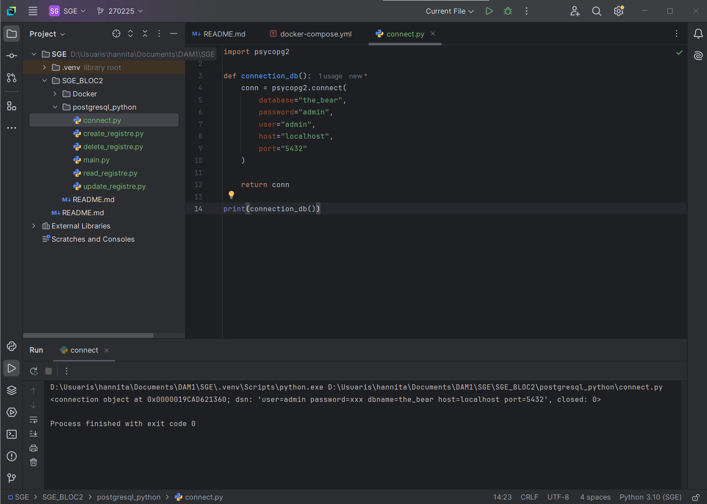

Si hi afegim: conn.close(), al fer la crida de la funcio en indica que el fitxer s'ha tancat 1 cop. 

El resultat del print és que la connexió ha sigut bona.

Ens dona informació sobre que s'ha creat un objecte de conneció en Python i dns que significa Data Source Name, ens dona la informació que es necessita per connectar-se a la bd (la que li hem indicat en el connect.py). 
Com que tota la informació indicada per a la connexió és correcta ens hem pogut connectar a la bd. 
 

2. Visualització de les dades

Per veure els serveis creats i que estan actius hem creat una taula de clientes i li hem afegit dades. 

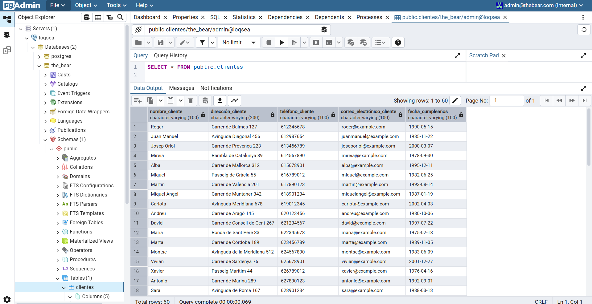

Per accedir hem buscat localhost:80 per poder accedir a pgadmin amb l'usuari i la contrasenya que tenia en el connect.py. 
Un cop dins hem de crear un servei el qual ens permetrà visualitzar la nostra tabla creada en la captura de dalt. 

3. Crear un nou registre.

Per començar, en el nostre arxiu creat al principi (create_registre.py) li afegim el següent codi en el qual li indiquem la informació que volem afegir i el codi per fer-ho.

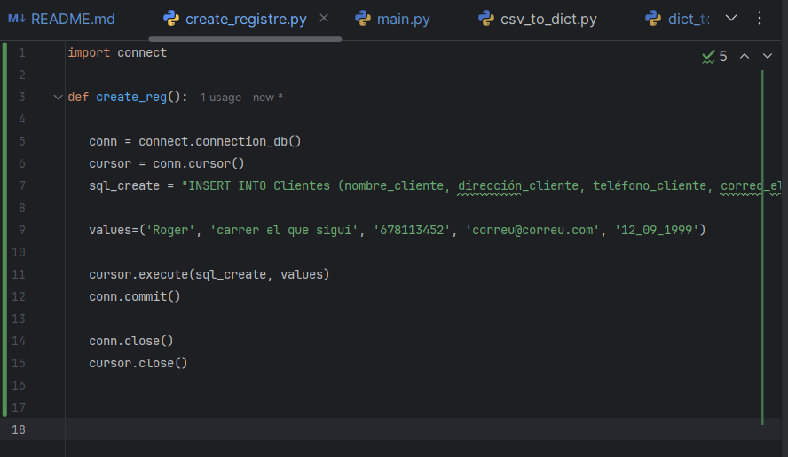

Per poder fer servir la funció creada l'hem de cridar en el main, per això hem d'importar l'arxiu per poder fer servir la funció. 

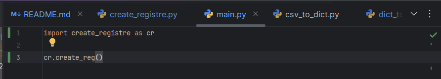

Finalment, en el pgAdmin podem visualitzar els canvis realitzats: 

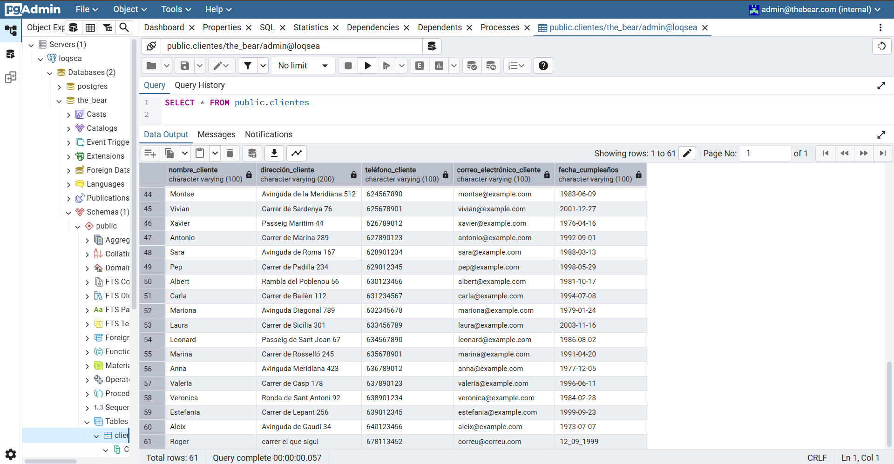

Podem veure com ha augmentat el volum de la nostra tabla (60 - 61 fila) i si baixem cap el final veurem el Roger que hem creat amb la funció create_reg.

4. Llegir registres.

Amb la consulta SELECT * podem seleccionar tots els registres per després mostrar-les. 

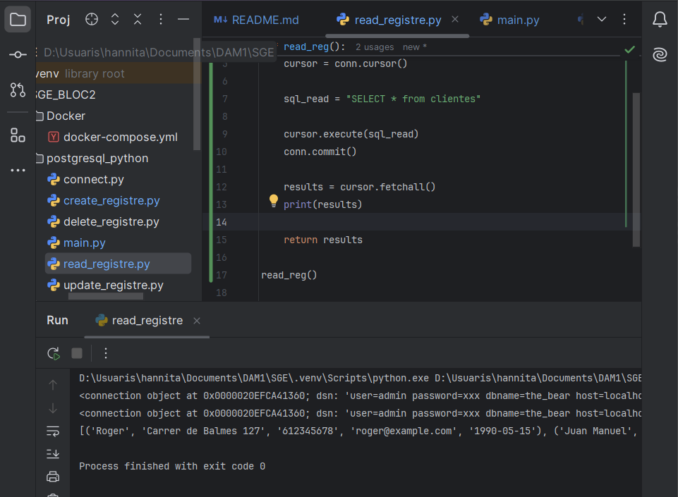

En el print(variable) li podem indicar un valor el cual correspondrà a l'idex i es seleccionarà només aquell registre que correspon a l'index indicat.

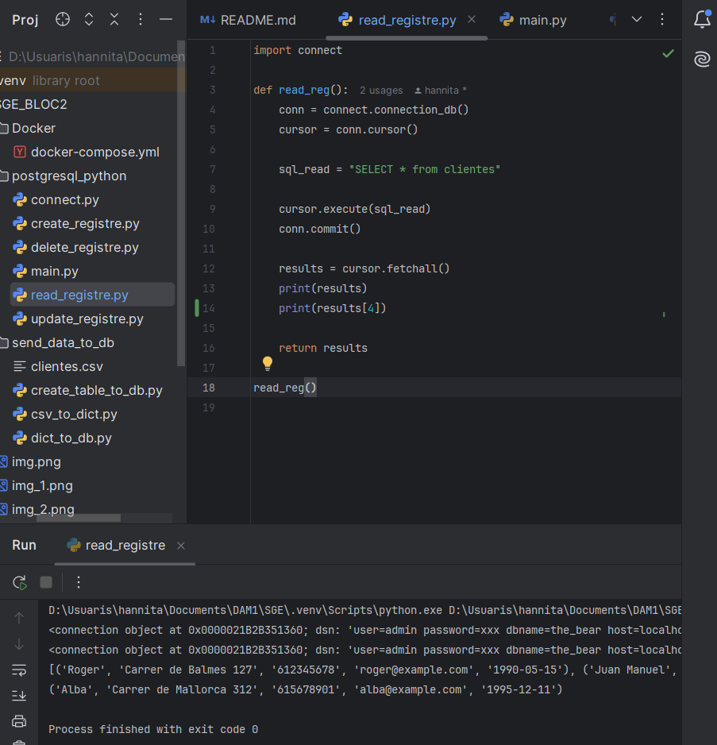

També podem seleccionar únicament una dada de la nostra "tabla", indicant la posició d'aquesta dins d'un registre.

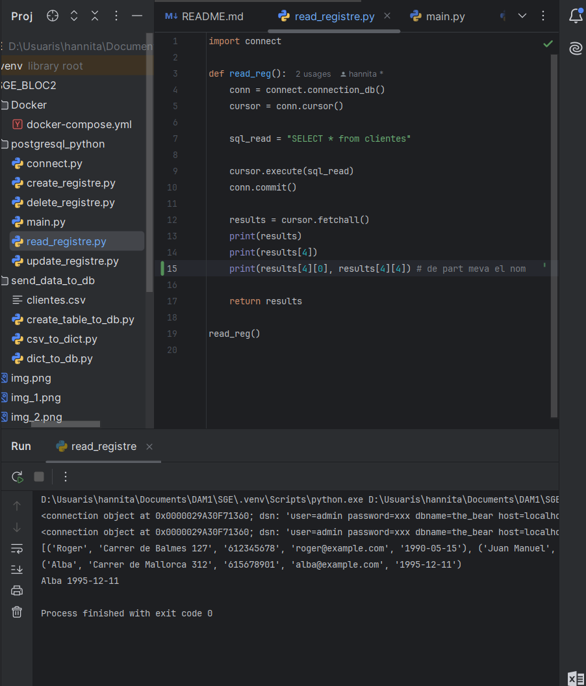

*INTENTS mini exercicis LISTS*

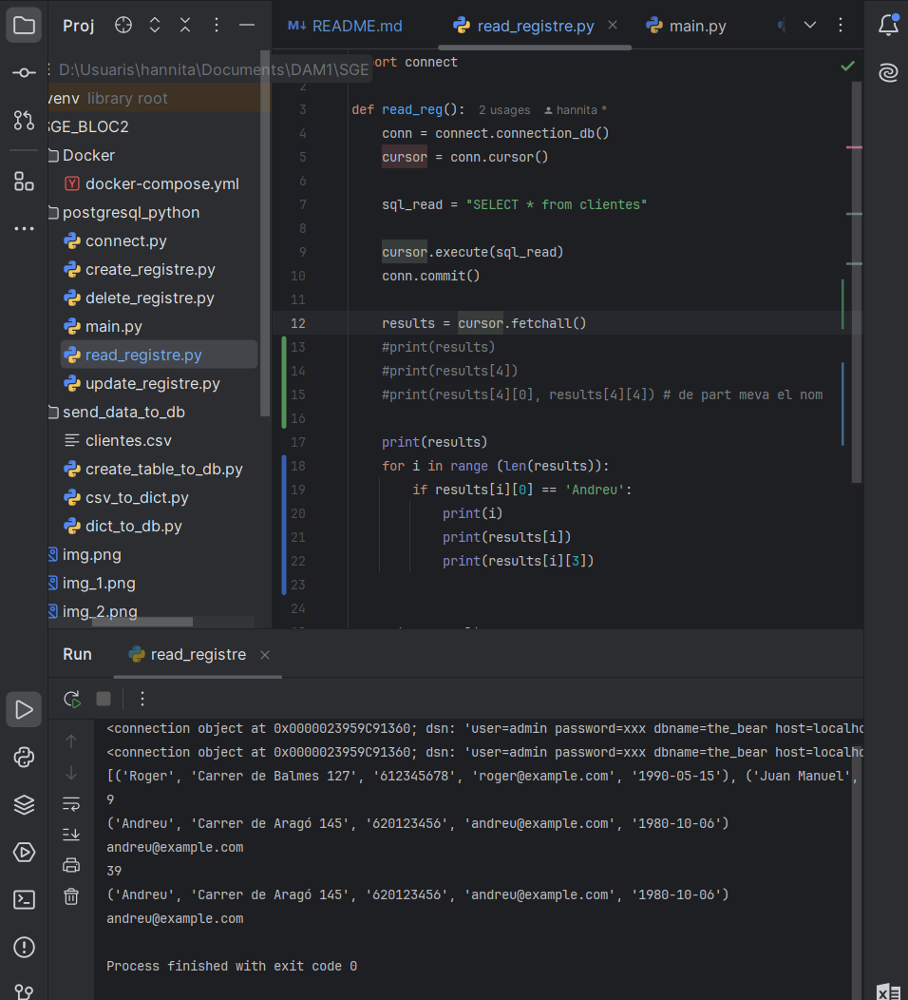

Aquí busquem a Andreu i un cop trobat seleccionem les seves dades i en concret el seu correu. 

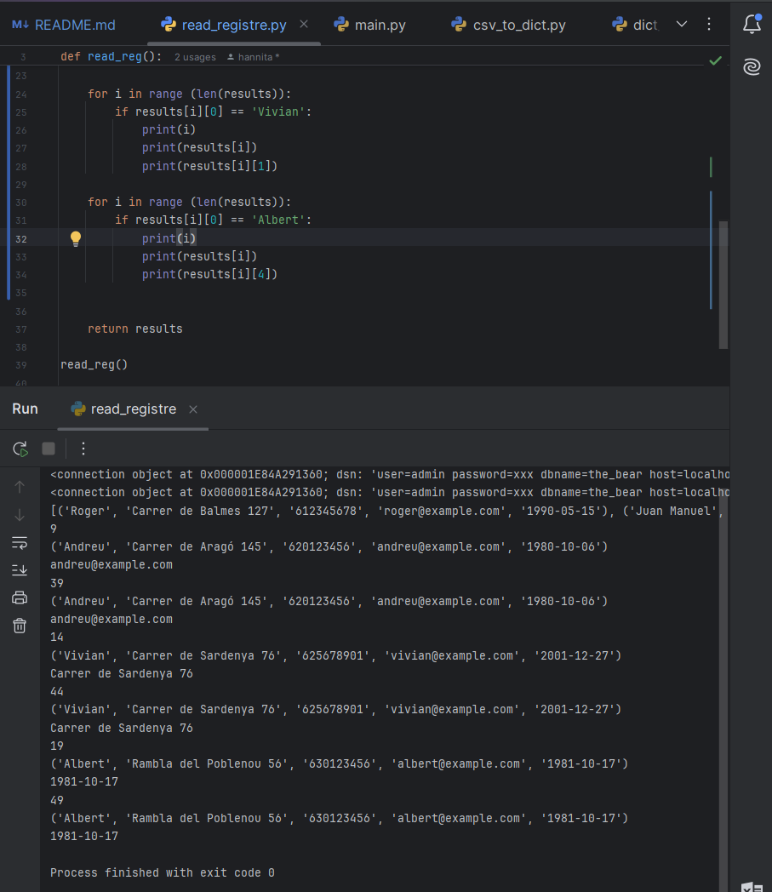

I finalment busquem les dades del Vivian i l'Albert, i seleccionem d'un la seva direcció i de l'altre la data del seu aniversari.

Tornant a Postgressql. 

Ara que ja sabem com funcionen els selectors podem fer tables amb les dades de cada registre. 

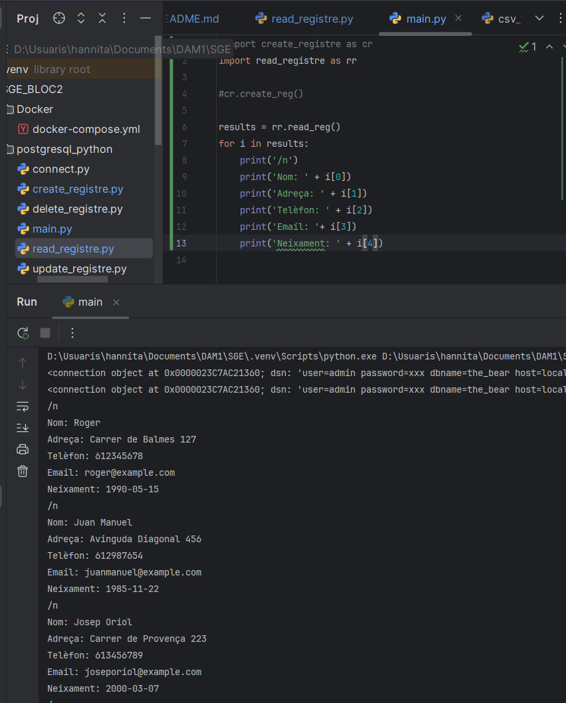

5. Actualitzar registres. 

Per actualitzar un registre podem fer servir UPDATE.

Creem una funció que ens ho faciliti i la cridem en el main. (no tenim l'tribut de id_client li posem com clausula de cerca el nom del client)

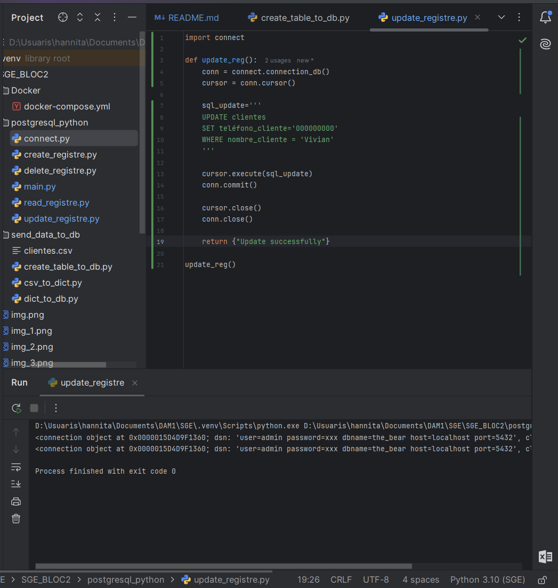

I també podem veure aquest canvi en la nostra tabla de pgAdmin: 

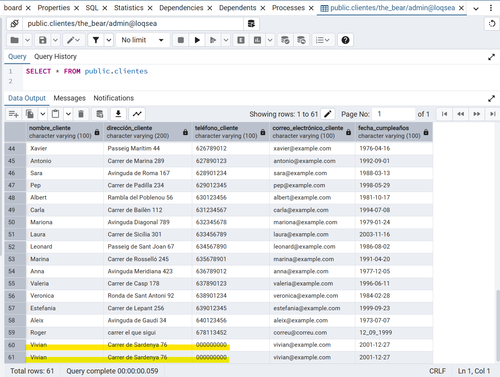

Veiem com en els noms d'Vivian tenim el número de teléfon té el que li hem indicat '000000000'.

